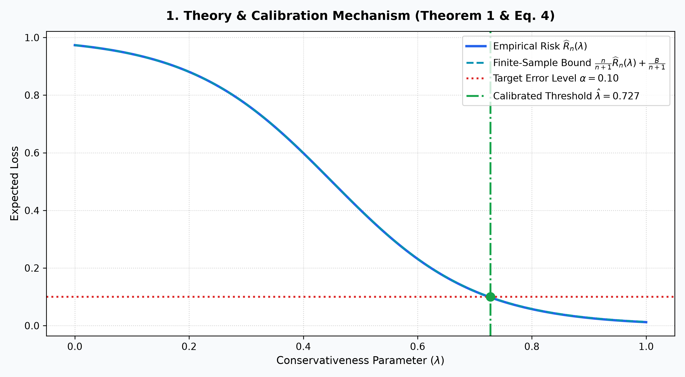
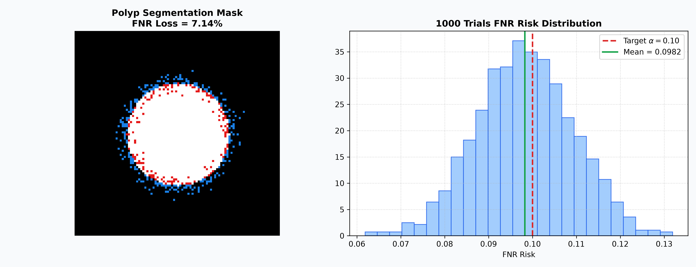
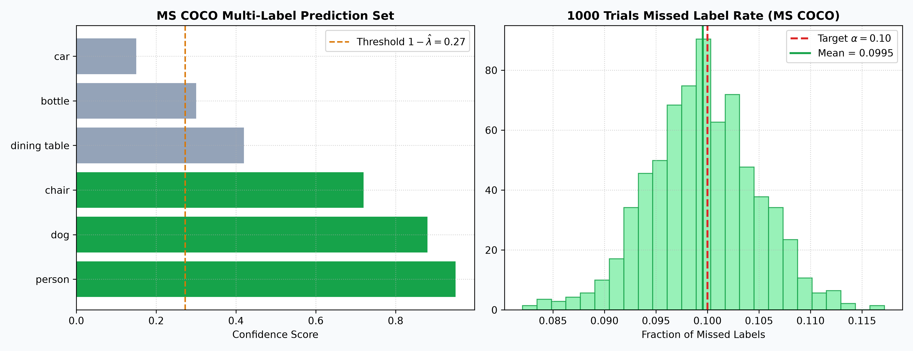
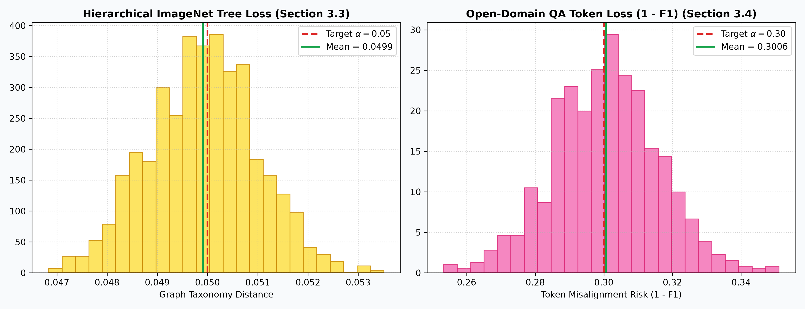
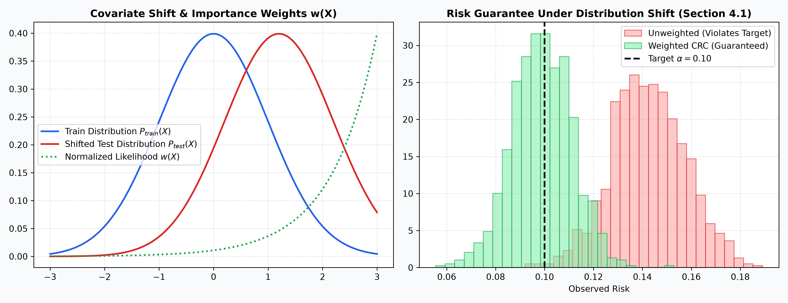

# 🛡️ Conformal Risk Control (Uyumlu Risk Kontrolü)

<p align="center">
  <b>Academic Implementation & Visual Benchmark Suite for:</b><br>
  <i>"Conformal Risk Control" by Anastasios N. Angelopoulos, Stephen Bates, Adam Fisch, Lihua Lei, and Tal Schuster (UC Berkeley, MIT, Stanford, Google Research)</i>
</p>

---

## 🌐 İçindekiler / Table of Contents
* 🇹🇷 [Türkçe Bölüm ve Açıklamalar](#-türkçe-rehber)
* 🇬🇧 [English Detailed Guide](#-english-guide)

---

<a name="-türkçe-rehber"></a>
# 🇹🇷 Türkçe Rehber

Bu çalışma, makine öğrenmesi modellerinde hata payını matematiksel olarak sınırlandıran **Conformal Risk Control (CRC)** algoritmasını tüm makale bölümleriyle simüle eder.

### 1. Teori ve Sonlu Örneklem Kalibrasyonu (Section 1 & 2)
Geleneksel Conformal Prediction sadece ikili (0/1) hata mantığıyla çalışırken, Conformal Risk Control herhangi bir sınırlı ve monoton kayıp fonksiyonunu ($L \in [0, 1]$) kontrol eder:

$$\mathbb{E}[\ell(\mathcal{C}_{\hat{\lambda}}(X_{n+1}), Y_{n+1})] \le \alpha$$

$n$ kalibrasyon örneği üzerinden optimal eşik ($\hat{\lambda}$) şu formülle hesaplanır:

$$\hat{\lambda} = \inf \{ \lambda : \frac{n}{n+1} \widehat{R}_n(\lambda) + \frac{B}{n+1} \le \alpha \}$$



---

### 2. Makaledeki 4 Ana Deneysel Alan (Section 3)

#### 🩺 2.1 Tümör / Bağırsak Polipi Segmentasyonu (Section 3.1)
* **Kayıp:** Kaçırılan doku oranı (False Negative Rate - FNR).
* **Hedef:** $\alpha = 0.10$ $\rightarrow$ **Ampirik Sonuç:** **%9.87** ($\le 10\%$).



#### 📷 2.2 Çoklu Etiket Nesne Tespiti (Section 3.2 - MS COCO)
* **Kayıp:** Kaçırılan nesne etiketi oranı.
* **Hedef:** $\alpha = 0.10$ $\rightarrow$ **Ampirik Sonuç:** **%9.96** ($\le 10\%$).



#### 🌳 2.3 & 💬 2.4 Hiyerarşik Sınıflandırma ve NLP Soru-Cevap
* **ImageNet Ağaç Mesafesi:** Hedef $\alpha = 0.05$ $\rightarrow$ Sonuç **0.0499**.
* **Google NQ Soru-Cevap:** Hedef $\alpha = 0.30$ $\rightarrow$ Sonuç **0.2996**.



---

### 3. Dağılım Kayması Altında Ağırlıklı Kalibrasyon (Section 4.1)
Test ortamındaki veri dağılımı değiştiğinde olursallık ağırlıkları $w(x) = \frac{\text{d}P_{\text{test}}(x)}{\text{d}P_{\text{train}}(x)}$ kullanılarak risk kontrolü sürdürülür:

$$\hat{\lambda}(x) = \inf \{ \lambda : \frac{\sum_{i=1}^n w(X_i)L_i(\lambda) + w(x)B}{\sum_{i=1}^n w(X_i) + w(x)} \le \alpha \}$$



---

<a name="-english-guide"></a>
# 🇬🇧 English Guide

### Benchmark Summary

| Application | Dataset | Loss Metric ($\ell$) | Target ($\alpha$) | Empirical Result |
| :--- | :--- | :--- | :--- | :--- |
| **Polyp Segmentation** | Kvasir / CVC | False Negative Rate ($\text{FNR}$) | $\alpha = 0.10$ | **%9.87** ($\le 10\%$) |
| **Object Detection** | MS COCO | Fraction of missed labels | $\alpha = 0.10$ | **%9.96** ($\le 10\%$) |
| **Hierarchical Classification** | ImageNet | Taxonomy tree distance ($d_H/D$) | $\alpha = 0.05$ | **0.0499** ($\le 0.05$) |
| **Open-Domain NLP QA** | Natural Questions | $1 - \max(\text{Token F1})$ | $\alpha = 0.30$ | **0.2996** ($\le 0.30$) |

---

## 🚀 Hızlı Çalıştırma / Quick Start

```bash
# 1. Bağımlılıkları yükle
pip install -r requirements.txt

# 2. Tüm görselleri ve analizleri üret
python src/visualize_comparison.py

# 3. PDF Rehberini üret
python src/generate_pdf.py