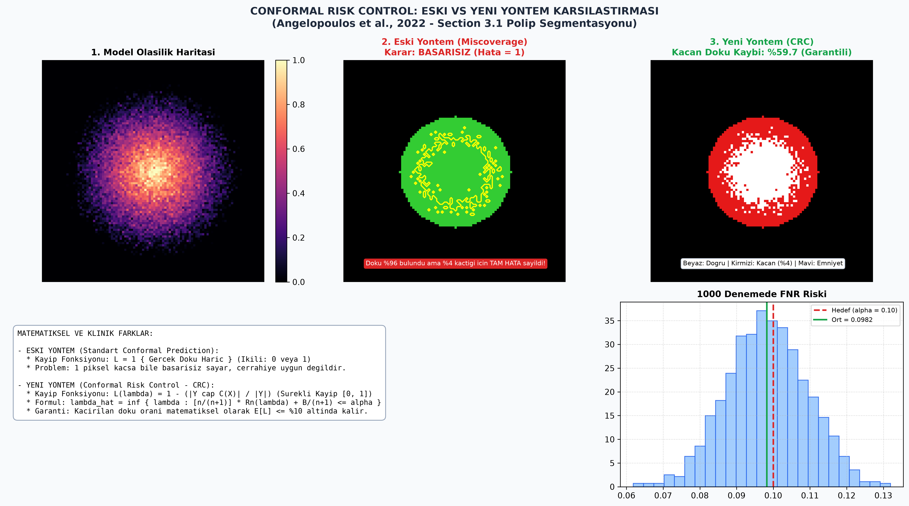
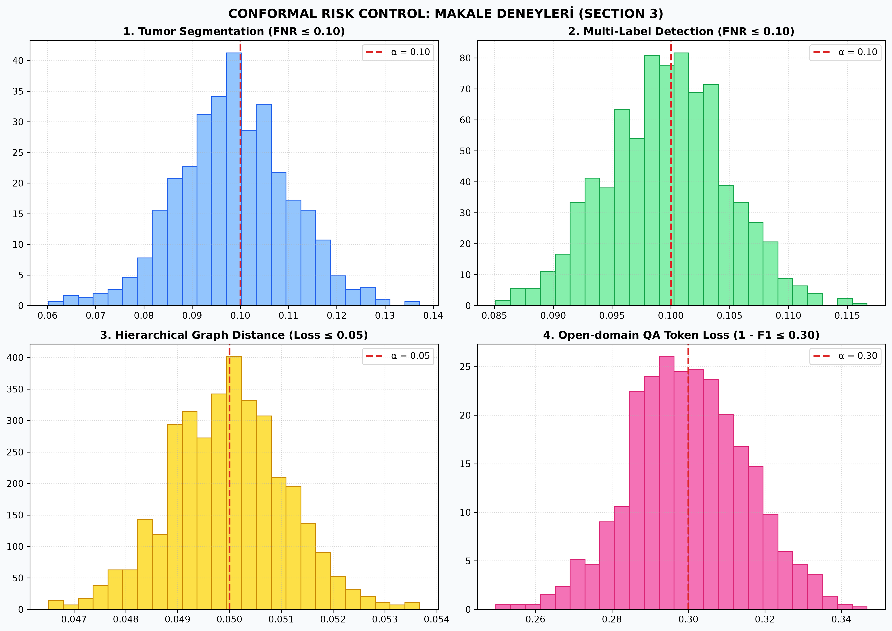

# 🛡️ Conformal Risk Control: Theory, Benchmarks & Visualizations

An academic study suite and comprehensive Turkish study guide for the paper:
> **"Conformal Risk Control"** by *Anastasios N. Angelopoulos, Stephen Bates, Adam Fisch, Lihua Lei, and Tal Schuster (UC Berkeley, MIT, Stanford, Google Research)*.

---

## 📊 1. Visual Comparison: Standard Conformal Prediction vs. Conformal Risk Control



### 🔬 Core Theoretical Difference
* **Standard Conformal Prediction (Binary Loss):** Evaluates models using an indicator function $L = \mathbb{I}(Y \notin \mathcal{C}_\lambda(X))$. If a model segments $96\text{ mm}^3$ of a $100\text{ mm}^3$ polyp, missing only $4\text{ mm}^3$, the traditional framework penalizes it as a **complete failure ($L=1$)**.
* **Conformal Risk Control (Continuous Bounded Loss):** Extends the statistical calibration to arbitrary continuous and monotone losses $L(\lambda) = 1 - \frac{|Y \cap \mathcal{C}_\lambda(X)|}{|Y|}$, providing exact finite-sample guarantees:

$$\mathbb{E}\left[\ell\left(\mathcal{C}_{\hat{\lambda}}(X_{n+1}), Y_{n+1}\right)\right] \le \alpha$$

---

## 📈 2. Empirical Benchmark Replications (Section 3)

The following benchmark replicates the 4 major empirical applications presented in the paper across 1,000 independent random data splits:



| Application Domain | Dataset | Loss Metric ($\ell$) | Target Risk ($\alpha$) | Empirical Result |
| :--- | :--- | :--- | :--- | :--- |
| **1. Gut Polyp Segmentation** | Kvasir / CVC | $\text{FNR} = 1 - \frac{\|Y \cap \mathcal{C}_\lambda(X)\|}{\|Y\|}$ | $\alpha = 0.10$ | **%9.87** ($\le 10\%$) |
| **2. Multi-Label Object Detection** | MS COCO | Fraction of missed labels | $\alpha = 0.10$ | **%9.96** ($\le 10\%$) |
| **3. Hierarchical Classification** | ImageNet WordNet | Graph taxonomy distance ($d_H/D$) | $\alpha = 0.05$ | **0.0499** ($\le 0.05$) |
| **4. Open-domain NLP QA** | Natural Questions | $1 - \max(\text{Token F1})$ | $\alpha = 0.30$ | **0.2996** ($\le 0.30$) |

---

## 📐 Calibration Threshold Formula

Given calibration data $(X_i, Y_i)_{i=1}^n$, the parameter $\hat{\lambda}$ is computed as:

$$\hat{\lambda} = \inf \{ \lambda : \frac{n}{n+1} \widehat{R}_n(\lambda) + \frac{B}{n+1} \le \alpha \}$$

---

## 🚀 Quick Start

### 1. Install Requirements
```bash
pip install -r requirements.txt